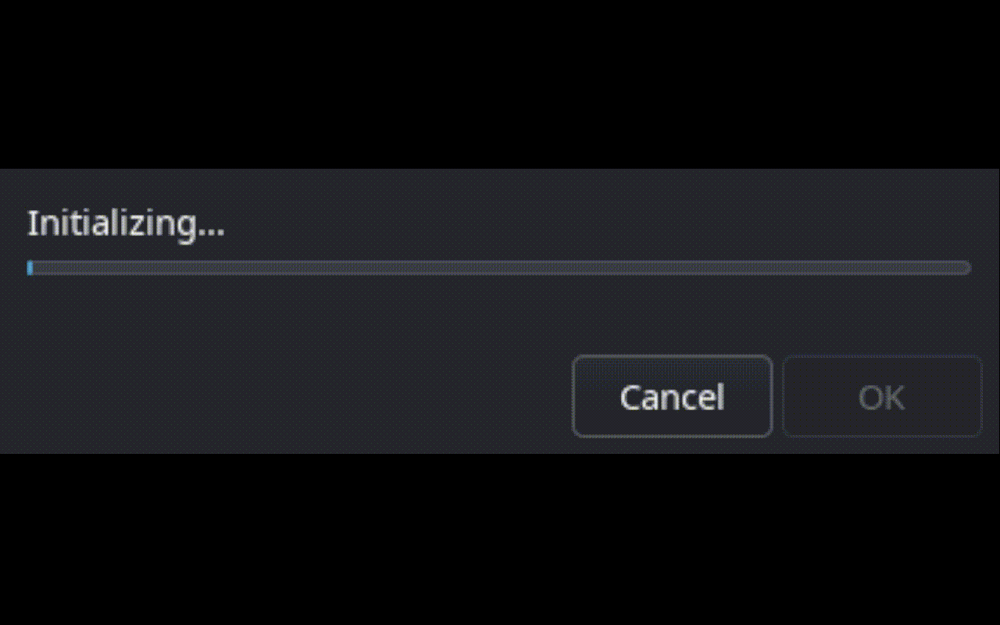

# Epoch Updater

A bash-based updater script for Project Epoch, a World of Warcraft custom server. The updater downloads and verifies game files by comparing MD5 hashes against a remote manifest.



This script was inspired by, and written with the help of [burneddi](https://github.com/brndd). It started with him explaining parts of his script to me, me contributing to his script, and later I wanted to make large structural changes compared to his script. 
This repository does not contain any lutris installers, like burneddi's repository does.
burneddi also made me aware of [epochcli](https://git.burkey.co/eburk/epochcli), compared to that project, this updater does not require any configuration, and this project gives you a graphical progress bar.


## Features

- **Automated File Verification**: Compares local file MD5 hashes against remote manifest
- **GUI Progress Tracking**: User-friendly progress dialogs using zenity
- **Steam Integration**: Seamlessly handles Steam launch arguments
- **CDN Fallback**: Multiple download sources for reliability (Cloudflare CDN → DigitalOcean → Generic URLs)

## Prerequisites

The following system packages are required:
- `curl`
- `jq`
- `zenity`

*Note: `md5sum` and `stat` are also required but are usually pre-installed.*

## Installation

1. Place `epoch-updater.sh` in your World of Warcraft directory (must contain `Wow.exe`)
2. Make the script executable:
   ```bash
   chmod +x epoch-updater.sh
   ```

## Usage

### Basic Usage

```bash
./epoch-updater.sh
```

### Steam Integration (Optional)

1. If you don't already have `Project-Epoch.exe` in the same folder as `Wow.exe` please run the epoch-updater.sh script one time first.
2. Add `Project-Epoch.exe` as a Non-Steam Game
3. Make sure Start In target is the folder that has `Project-Epoch.exe` and `Wow.exe`, it should already be the correct value.
4. Set Force the Use of a Specific Steam Play Compatibility tool by: right clicking the game, Properties, Compatibility.

```
./epoch-updater.sh %command%
```

Technically, the script will detect it is running in Steam, and rewrite Steam's launch command so that the script is running inside the Steam Runtime, and inside gamescope (if in use). We need to do this so we are able to display the window with the progress bar on systems that use gamescope

## How It Works

The script works very similar to how the official launcher works, and downloads the same manifest.
The updater operates in two phases:

1. **File Check Phase (0-10% progress)**
   - Downloads manifest from `https://updater.project-epoch.net/api/v2/manifest`
   - Parses JSON to get file list
   - Compares local file MD5 hashes against manifest

2. **Download Phase (10-100% progress)**
   - Downloads missing or modified files
   - Tracks progress with real-time updates
   - Verifies downloaded files by size and MD5 hash

## Todo?

This tool should™ be more or less complete and not need any updates. 
The only possible updates that I can imagine is letting this updated download the full client if it's missing.
Or if there are any lutris or other launchers with gamescope needs a similar treatement as the steam Integration.
